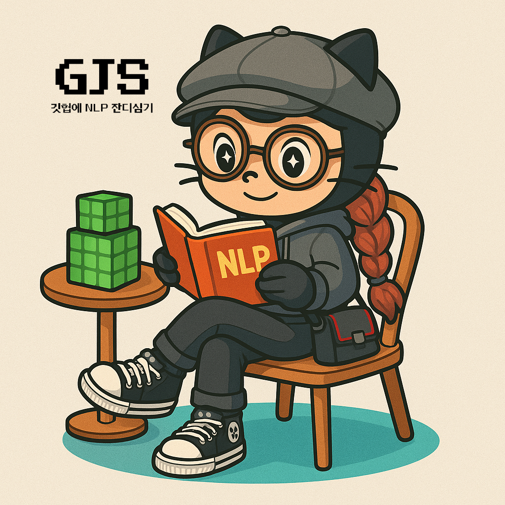

<div align="center">
  <table>
    <tr>
      <td align="center" width="15%">
        
      </td>
      <td align="center">
        <h1>GJS: 깃헙에 NLP 잔기심기 🌱</h1>
        <p><em>Emotion-aware tool-augmented chatbot on Discord</em></p>
      </td>
      <td align="center" width="15%">
        
      </td>
    </tr>
  </table>
</div>

<p align="center">
  <a href="#">
    
  </a>
</p>

---

## 📋 Overview

**GJS** (short for *깃헙에 NLP 잔디심기*) is a modular, emotion-aware Discord chatbot powered by LangChain and MCP.  
It uses external tools (music, places, search) to deliver emotionally contextual recommendations in natural Korean conversation.

---

## ✨ Features

- 🤖 Emotion-friendly casual-speaking LLM agent
- 🎵 Music recommendations (Spotify API)
- 📍 Place recommendations (Naver Place API)
- 🔎 Web search (Tavily API)
- 💬 Discord-based chat and image input
- 🧩 Modular MCP tool architecture

---

## 🗂 Project Structure

```bash
FRIENDLY-AGENT-BOT/
├── mcp_tools/
│   ├── naver_place.py
│   ├── search.py
│   └── spotify.py
├── bot.py
├── mcp_manager.py
├── config.json
├── .env
└── README.md
```

---

## ⚙️ Setup

### 1. `.env` file

```env
NAVER_CLIENT_ID=...
NAVER_CLIENT_SECRET=...
SPOTIFY_CLIENT_ID=...
SPOTIFY_CLIENT_SECRET=...
TAVILY_API_KEY=...
DISCORD_TOKEN=...
```

### 2. Install requirements

```bash
pip install -r requirements.txt
```

---

## 🔧 MCP Config (`config.json`)

Tool servers are automatically launched by `bot.py`.

```json
{
  "mcpServers": {
    "spotify": {
      "command": "python",
      "args": ["./mcp_tools/spotify.py"],
      "transport": "stdio"
    },
    "place": {
      "command": "python",
      "args": ["./mcp_tools/naver_place.py"],
      "transport": "stdio"
    },
    "search": {
      "command": "python",
      "args": ["./mcp_tools/search.py"],
      "transport": "stdio"
    }
  }
}
```

---

## ▶️ Run

```bash
python bot.py
```

- Use `!채팅` or post in `#chatbot` channel.
- Run `!clear` to reset history.

---

## 💬 Example

> **User**: I'm feeling kind of down...  
> **Bot**: I know that feeling 😢 Maybe go to [Slow Café](https://map.naver.com/...) and listen to [Blue Hour](https://open.spotify.com/...)?

---

## 🛠 Tech Stack

| Type         | Stack/API                           |
|--------------|-------------------------------------|
| LLM          | Ollama, LangChain                   |
| Tool Runtime | FastMCP, MultiServerMCPClient       |
| Platform     | Discord.py, dotenv, requests        |
| APIs         | Spotify, Naver Place, Tavily        |

---

## 🚀 Roadmap

- Emotion-based tool triggering
- Conversation + log visualization
- Web frontend (optional)
