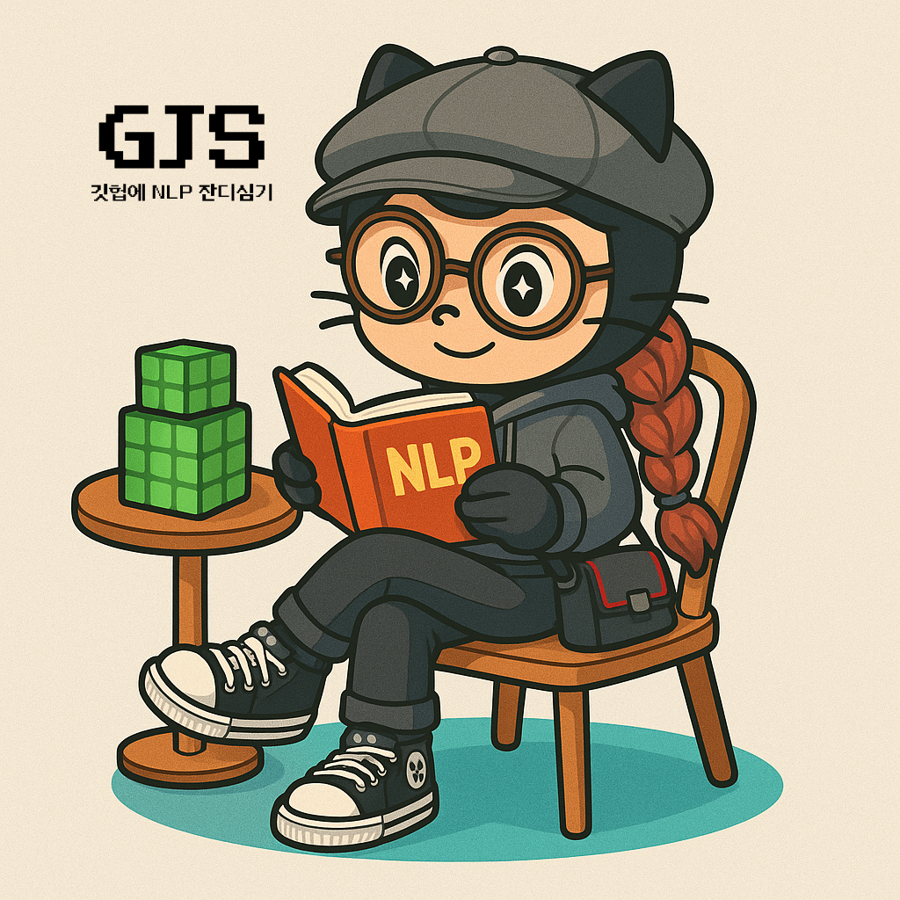

<div align="center">
  <table>
    <tr>
      <td align="center" width="15%">
        
      </td>
      <td align="center">
        <h1>GJS: 깃헙에 NLP 잔기심기 🌱</h1>
        <p><em>Emotion-aware tool-augmented chatbot on Discord</em></p>
      </td>
      <td align="center" width="15%">
        
      </td>
    </tr>
  </table>
</div>

<p align="center">
  <a href="#">
    
  </a>
</p>

---

## 📋 소개

**GJS**는 감정을 이해하고 반응하는 챗봇입니다. LangChain + MCP 구조로 여러 툴을 동시에 사용하며,  
노래/장소/정보 검색을 사용자 기분에 맞춰 자연스럽게 추천합니다.

> "갓챗에 NLP 잔디심기"의 줄임말이에요. 잔디는 곧 대화의 흔적이자 커밋 🌿

---

## ✨ 주요 기능

- 🤖 반말로 말하는 감정 공감 챗봇
- 🎵 Spotify 기반 노래 추천
- 📍 Naver API로 장소 추천
- 🔎 Tavily 기반 웹 검색
- 💬 Discord에서 실시간 채팅 + 이미지 입력
- 🧩 MCP 기반 독립형 툴 구조

---

## 🗂 폴더 구조

```bash
FRIENDLY-AGENT-BOT/
├── mcp_tools/
│   ├── naver_place.py
│   ├── search.py
│   └── spotify.py
├── bot.py
├── mcp_manager.py
├── config.json
├── .env
└── README.md
```

---

## ⚙️ 설치 방법

### 1. `.env` 파일

```env
NAVER_CLIENT_ID=...
NAVER_CLIENT_SECRET=...
SPOTIFY_CLIENT_ID=...
SPOTIFY_CLIENT_SECRET=...
TAVILY_API_KEY=...
DISCORD_TOKEN=...
```

### 2. 패키지 설치

```bash
pip install -r requirements.txt
```

---

## 🔧 MCP 설정 (`config.json`)

`bot.py`에서 MCP 툴을 자동으로 실행합니다:

```json
{
  "mcpServers": {
    "spotify": {
      "command": "python",
      "args": ["./mcp_tools/spotify.py"],
      "transport": "stdio"
    },
    "place": {
      "command": "python",
      "args": ["./mcp_tools/naver_place.py"],
      "transport": "stdio"
    },
    "search": {
      "command": "python",
      "args": ["./mcp_tools/search.py"],
      "transport": "stdio"
    }
  }
}
```

---

## ▶️ 실행 방법

```bash
python bot.py
```

- Discord 채널에서 `!채팅` 또는 `#chatbot` 사용
- `!clear` 입력 시 기록 초기화

---

## 💬 대화 예시

> 🙋 사용자: 요즘 좀 지치네...  
> 🤖 봇: 나도 그런 날 있었어 ㅠㅠ [브루잉카페](https://map.naver.com/...) 가서 [healing song](https://open.spotify.com/...) 듣는 건 어때?

---

## 🛠 기술 스택

| 종류       | 내용 |
|------------|------|
| LLM        | Ollama, LangChain |
| 툴 실행    | FastMCP, MultiServerMCP |
| 플랫폼     | Discord.py, requests, dotenv |
| 외부 API   | Spotify, Naver Place, Tavily |

---

## ✨ 향후 계획

- 감정 기반 추천 고도화
- 로그 저장 및 시각화 도구
- Web 기반 챗 인터페이스 연동 (옵션)
